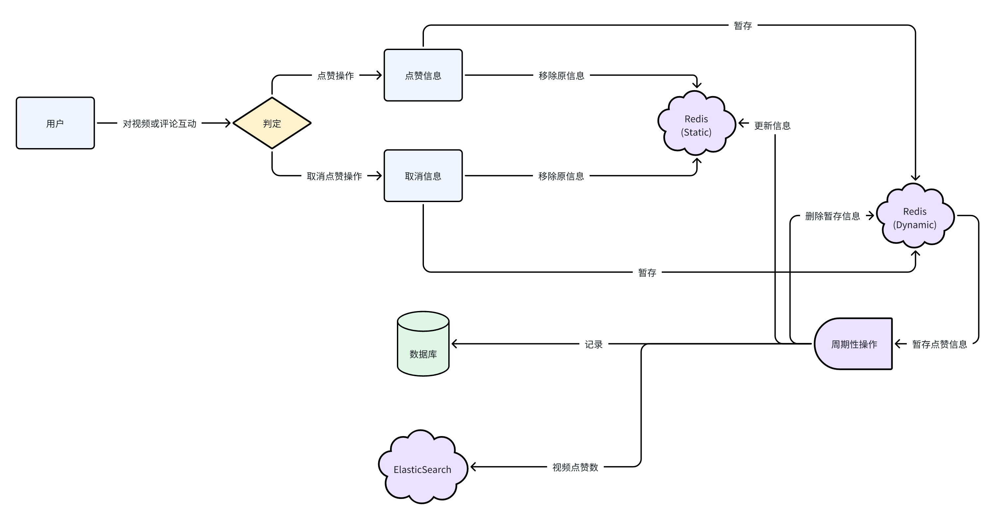

## /like/action

点赞操作属于高频操作，故先将记录保存至Redis。而Redis内分为静态区(旧信息居多)和动态区(新信息居多)，旨在减少同步操作时忽略点赞信息的更新时间而造成的重复操作（即，原先为将Redis内的全部点赞信息同步至数据库，由于数据存在重复率高的问题，会给数据库造成不必要的负担；而现在只需要把上次同步后时间段的点赞信息同步至数据库即可）。当服务端执行同步操作时，会把点赞数据同步至MySQL和ElasticSearch；而对于Redis内的静态区和动态区，会删除动态区内已同步至数据库的信息并添加至静态区（点赞信息并不重要，故如果此操作导致用户新的点赞信息失效，也可忽略不计）。
注：对静态区采用的数据结构为Redis.Set，认为静态区内均是“Like”；对动态区Redis.SortedSet，但其实只有1与2两个值，表示“Like”和“Dislike”。

