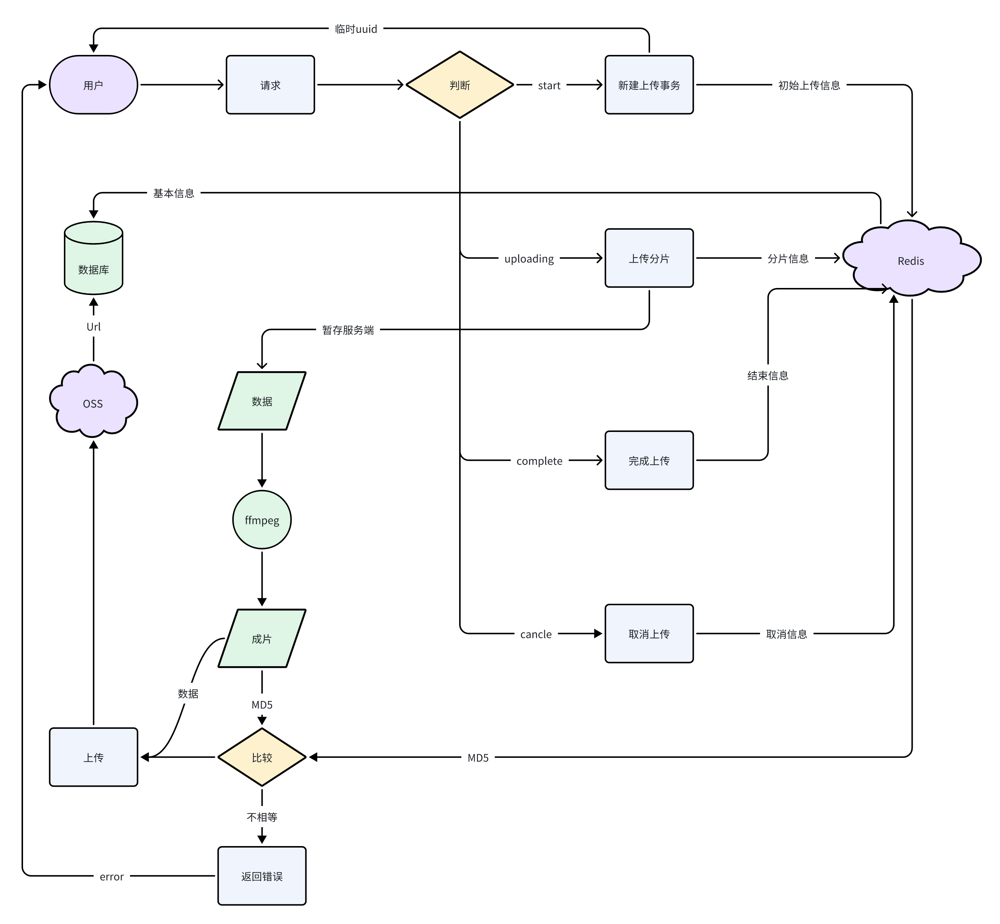

## /video/publish

### 视频上传被分为四个部分

#### start
用户向客户端请求新建上传事务，该事务拥有一些基本信息，比如标题、描述、分块数量。服务端接受后，会返回临时uuid，该uuid作为上传视频的临时凭证。同时Redis会记录基本信息并创建一个分块完成表(bitmap)。

#### uploading
用户携带uuid发送视频分片信息，服务端会在Redis判断是否序号重复，若不重复，会对完成分片序号置1。

#### cancle
用户携带uuid发送取消信号，服务端会完成相应的信息删除操作

#### complete
用户携带uuid发送完成信号，服务端会判断完成是否成立（检测MD5以及分块序号是否全部置1）。若成立，会用ffmpeg将分片组装成规定码率的mp4，并用首帧生成封面；接着，上传至OSS，获得URL；最后，将Redis内的视频信息与其他基本信息合成，导入到数据库后，事务结束。

