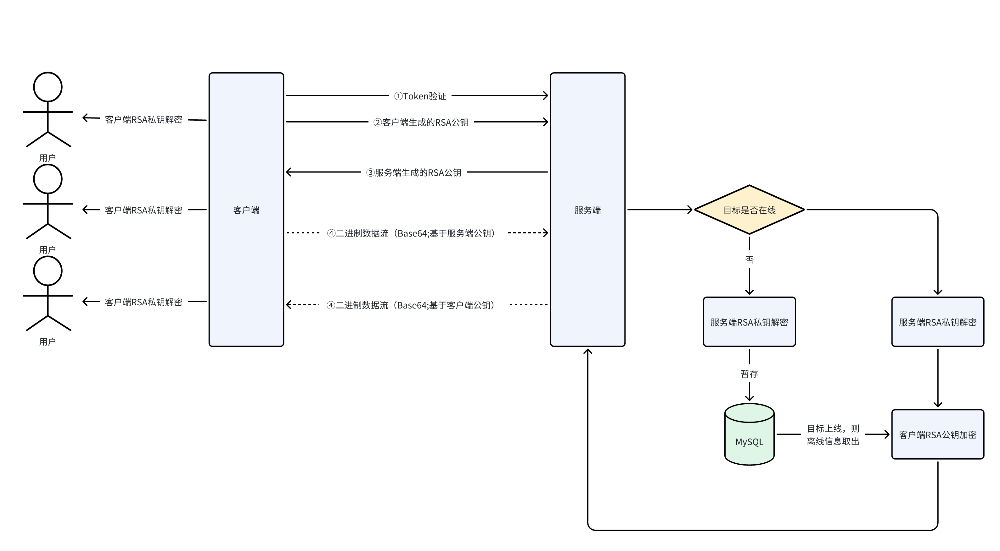

## websocket:chat

### 消息传达
当目标用户在线时，消息会立即发送到目标用户对应的连接上；用户不在线时，会将消息暂存到MySQL内

### 安全性
目前只用到简单的RSA方法以实现基础的安全性。

1. 用户需要将自己生成的**客户端RSA公钥**发送至服务端(必需)，公钥应当放在**Header.rsa_public_key**上，以保证为Binary(base64)传输
2. 与服务端建立连接后，服务端会发出一个**服务端RSA公钥**
3. 客户端应当发送用**服务端RSA公钥**加密后的消息，以Binary(base64)发送至服务端
4. 服务端接收到消息后会使用**服务端RSA私钥**解密，(如果目标用户在的话)接着用目标用户的**客户端RSA公钥**加密，以Binary(base64)发送至目标用户
5. 目标用户应当使用自己的**客户端RSA私钥解密**

故，非对称性加密(RSA)由**公钥加密**|**私钥解密**作为保障。

